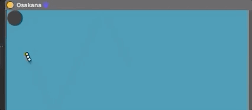

# Osakana is M4L devivce
Osakana is Max for live device.
This plugin made with p5js + Max for live.

You can use audio effect plugin on ableton live as LFO.
You can click mouse on GUI.
This plugin output position of each osakana(fish), Overall distribution, average.
